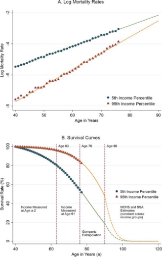

**Georgia Institute of Technology School of Business**

**MGT 6203: Data Analytics in Business Spring 2024**

**Team 6 Final Project Report:**

Optimizing Retirement Investments for Long-Term Sustainability

**Team Members:**

Member 1 : Austin Franks | Edx username: austin\_franks22 | GitHub username: Austin-Franks

Member 2 : Elson Dauti | Edx username: elsondauti | GitHub username: edauti91

Member 3 : Peter Chu | Edx username: pychu\_2 | GitHub username: peterychu

Member 4 : Kenichi (Ken) Sugimoto | Edx username: sptd | GitHub username: etlfs

Member 5 : Suleman Shehzad | Edx username: sulemanshehzad

\***Note**: Suleman Shehzad withdrew from the course in March. **Project Repository:[ Team 6 on GitHub](https://github.com/MGT-6203-Spring-2024-Edx/Team-6)**

**Background/Problem Statement**

Retirement is one of the largest lifestyle changes that an individual undergoes. An average American citizen is expected to live 20 years beyond their retirement date where they must find a way to provide for themselves without employment. Retirement can be a celebration of the beginning of a new chapter in life, but also can be stressful if one is not financially prepared for it. The median wealth for an individual of retirement age is $52,000 (Poterba, 2014) leaving them heavily reliant upon programs like Social Security to cover expenses. Such a low amount of wealth can be attributed to various factors such as high cost of living, low compensation, lack of steady employment, poor financial planning, or lack of optimal financial investing. This project hones in on optimizing financial investing to improve quality of life in retirement.

Not only does a larger amount of wealth make for a more comfortable retirement, but also it has been identified that it can help in extending the life expectancy of an individual. The richest man in the United States is expected to live 15 years longer than the poorest, while this gap is 10 years for women (Chetty et al., 2014). Chetty goes on to highlight how having more wealth gives access to better healthcare, healthier diets, and better fitness among other factors as shown in *Figure 1*.

Figure 1: Mortality Rates Based Upon Income (Chetty et al.)

A powerful tool for meeting one’s financial retirement goals is the stock market. It has historically had positive returns over a long time, and there are many different kinds of stocks for a person to invest into. For example, there are stocks that generate higher returns than average, but are also riskier. There are also stocks that have smaller returns than the market average, but have basically guaranteed returns. These many “risky” and “safe” stocks enable investors to construct unique stock portfolios to achieve their retirement goals.

**Research Questions:**

Given a retirement age goal of 67 for an individual (year 2042), the analysis put together aims to answer the question: How does one construct the optimal 401 (k) investment strategy to achieve a comfortable retirement that is not reliant upon social programs? This question can be broken down into three smaller questions that can all be addressed to provide a holistic answer.

1. Is it possible to predict life expectancy given an individual’s personal information?
1. What are the expected annual expenditures during retirement?

What is the best investment strategy to achieve these goals? (In this project best is considered the investment strategy with highest returns and acceptable standard deviation.

**Initial Hypothesis:**

The group’s initial hypothesis is life expectancy will be predictable with a linear model. They should expect to annually spend $150,000 annually on expenditures. A heavy large cap value stock investment strategy is the ideal way to accrue wealth while minimizing risk.

**Methodology**

The first question to be tackled is the life expectancy of retirees. The University of Wisconsin Population Health Institute aggregates data at the county level detailing metrics such a percentage of smokers, life expectancy, obesity rate, binge drinking rate, flu vaccination rate, and income. Given this data, a linear regression of life expectancy versus various other predictor variables is constructed to give future retirees a data supported estimate of life expectancy. To estimate annual retirement expenditures, an analysis of CPI and current retirement spending conditions will be used to extrapolate out into the future.

With the wealth goal generated from the first two phases of the workflow, we can begin to create investment options. 9 investment funds with various investment strategies and returns were selected to construct 4 different investment portfolios. Each fund has at least 20 years of history to ensure that there is a sufficient amount of data to provide meaningful insights. A factor regression was used to characterize the attributes of each investment fund. Additionally, Sharpe and Treynor ratios will be employed to identify the risk vs. reward of each fund.

Finally, the portfolio with the highest returns is selected and used to calculate the necessary amount of money needed at retirement to ensure a retirement life without the need to reinvest or rely upon programs like social security.

**Datasets/Cleaning and initial insights**

The first data set to be analyzed was the life expectancy data from the University of Wisconsin. It contains 720 different columns within the data. To get the data down to a reasonable size that could have a reasonable amount of regressions to be analyzed, it was narrowed down to 9 columns that the team predicted would be applicable to a life expectancy at the individual level. Some stats like infancy death rates would not apply to an adult that is already in the workforce. The University provided a data dictionary that helped to explain some of the column names.

Oftentimes one piece of data such as flu vaccinations had multiple columns including percent of population, a numerator, a denominator, and a handful of confidence level columns. For this analysis, the percent of population was the most effective column type to be used. Some additional cleaning involved steps were that the second row in the data was not actual data and about 50 rows did not have life expectancy estimates. Given that life expectancy is the outcome variable, those rows were removed.

Figure 2: Life Expectancy Histogram

There were about 20 outlier points in the life expectancy data, as shown in *Figure 2*, as well with those counties having a life expectancy over 90 or under 67 that were removed. These counties did not have a large enough population to instill confidence in the validity of the numbers. Figure 2 above depicts life expectancy having a normal distribution.

To predict future retirement expenses, we utilized two datasets: one detailing 20 years of monthly inflation rates (CPI) and another tracking average annual expenses for U.S. citizens. The inflation rate was distilled to a fixed annual increase by averaging monthly rates per year and then determining the median increase across years. For average expenses, we calculated yearly percentage growth to find a consistent growth factor. Using the 2022 expense data and combining the fixed inflation and expense growth rates, we estimated the average expenses for 2042.

To find out how we can achieve our financial retirement goal, we used 9 assets. The individual 9 assets are as follows:

1. TLT - iShares 20 Plus Year Treasury Bond ETF
1. QQQ - Invesco Nasdaq 100 composite index ETF
1. XLE - Energy Select Sector SPDR Fund
1. VSMCX - Invesco Small Cap Value Fund Class C
1. IVV - Vanguard S&P 500 ETF
1. XLP - Consumer Staples Select Sector SPDR Fund
1. XLV - Health Care Select Sector SPDR Fund
1. XLI - Industrial Select Sector SPDR Fund
1. XLF - Financial Select Sector SPDR Fund

They have been carefully selected to have diverse & extensive coverage of various industry sectors as well as asset characteristics, such as growth, large cap vs small cap, bond vs stock.

For each asset we chose to use monthly data starting from January 2004 to December 2023 (20 years exact) as we believe that 240 data points (20 years in months) is sufficient enough for our intended research and analysis. The raw data was pulled from Yahoo Finance and included attributes such as the data, the monthly adjusted close, and any dividends paid out. This raw data was then transformed to include each month’s simple return to calculate various metrics such as each asset’s Beta Value. For the risk free rate we chose to use 1 month constant maturityT-bills and the data was collected from the Federal Reserve Bank of St. Louis

Table of calculated statistical metric

Figure 3: Statistical metrics of each asset

From these calculated metrics, we can choose how to build various portfolios for further analysis. Some initial insights, *Figure 3*, show that on average, most of our assets performed better than the market due to having Beta values greater than 1, but had higher risks as they had Sharpe Ratios higher than the market Sharpe Ratio. Another initial insight is that all of the assets have negative Sharpe and Treynor Ratios. This suggests that the risk free asset we used, 1 month maturity T-Bills, may be worthwhile to investigate. Using this information, we can perform more analysis on portfolios with different asset weights to best answer our research question.

For the factor regression, we have selected 5 factors as follows:

MKT (market), SMB (size), HML (value), RMW (profitability), CMA (investment)

Also we collect the risk free rate of returns which is the yield of short term treasury bills.

Data source is Fama French 5 factor models hosted on Dartmouth university server. (URL in the reference section at the end of this document)

For reference, this website also describes each factor in detail.

**Life Expectancy Regression**

To predict an individual’s life expectancy, a linear regression was performed on the life expectancy data from the University of Wisconsin. In *figure 4*, all predictor variables besides a flu vaccination are significant at the 5% level. R-squared values indicate that the model can moderately predict the life expectancy based on these predictor variables. The sign of each coefficient makes logical sense with negative events like poor mental health days, smoking, heavy air pollution, and a long commute negatively affecting one’s life span. On the other hand, getting a flu vaccine and having a higher income leads to a longer life.

Figure 4: Life Expectancy Regression

One important check when performing a linear regression is a multicollinearity test. Below is a correlation matrix between all of the predictor variables. The strongest correlations were poor mental health days/smoking and median income/smoking. A potential explanation is that lower income households are more likely to have individuals that smoke. Additionally, smoking can cause anxiety which can lead to having more poor mental health days.

Figure 5: Correlation Matrix

To dive deeper into the matter, a variance inflation factor calculation was run on the predictor variables. VIF values for all variables lie within the 1-5 range. According to literature, a VIF within this window indicates a moderate correlation between predictors, but not strong enough to justify removing any from the linear regression model. It can be concluded that the life expectancy model detailed in *Figure 3* is a valid model.

**Predicted Annual Expenses & Annual Inflation Rate**

To calculate how much a person needs to invest to live off passive income if they decide to retire in 2042, we need to calculate the average annual expenses that an individual incurs.

For this project, we have chosen to consider the entire U.S. population collectively without differentiating by state-specific factors, despite the significant demographic and economic differences between states. This approach allows us to include all relevant expense categories (such as rent, car or health insurance, medical expenses, groceries, etc.) to provide a comprehensive annual calculation of average expenses across the nation.

This first step is accompanied by annual inflation rates to provide a better analysis. To calculate the annual inflation rate, multipliers were set in the model to see how much the price has changed month by month. Then a moving average was used to calculate the annual percentage change to smooth out short-term fluctuations and highlight longer-term trends in inflation, and then the mean was calculated.

Figure 6: Smoothed Yearly Inflation

This was used to start the predictions for the average expense adjusted by the mean smoothed inflation change as shown above in *Figure 6*. A recursive calculation was used for each year from 2023 to 2042 as the chosen endpoint for our individual deciding to retire.

Figure 7: Sensitivity Analysis

At the end of our model, after deciding on a fixed annual percentage increase for the inflation rate as the median percentage, and after obtaining a median increase in expenses that an individual must face with data collected from 2004 to 2023, we used the median percentage obtained from the inflation increase as a fixed multiplier. This was multiplied by the annual percentage increase in expenses based on the last figure of 2023 as the starting point for our prediction of the average expenses in 2042 resulting in a predicted expense for 2042 of $118,553. There will continue to be inflation beyond 2042, but an individual can counteract this by purchasing treasury bonds.

**Factor Regressions**

Continuing off our initial analysis of the individual 9 assets, we first visualize the cumulative returns of individual factors for the past 20 years. As in *Figure 8*, we observe the market factor to be the dominant winner, followed by the profitability factor.

Figure 8: Factor Cumulative Returns

For factor regression, we conduct 9 separate linear regressions using R lm() functions, where we regress the monthly returns of individual assets minus the risk free rate of returns to the monthly returns of the above five factors. The results of the regressions are summarized into a table below generated using the Stargazer package in R.

As shown in *Figure 9*, the market factor and the value factor proves to be significant for most assets. Some of the interesting observations are 1. Small cap fund (VSMCX) has higher beta to the market return, indicating it is riskier but can have more returns, which confirms intuition that smaller stocks may collapse more easily but when they blossom, their returns can be extraordinary. All the giants (e.g. Apple, Microsoft) were once smaller stocks. So it is a worthy consideration to allocate some of the capital to those small stocks via VSMCX fund. Another interesting observation is how XLP (consumer staples ETF) has lower beta coefficient to the CMA (investment aggressiveness) factor. This is because the consumer staple industry is “secular” (as in, relatively immune to the macro economic condition compared to other industry sectors) in nature. Another interesting observation is TLT’s market beta coefficient is slightly negative, which makes sense as TLT is essentially a “bond” ETF which historically has been known to have inverse correlation to the equity market.

Figure 9: Factor Regression Summary

**Retirement Portfolio Selection**

Incorporating the factor regression analysis, four distinct portfolios were created to determine the best portfolio for our retirement investment. Each portfolio represents its own investment thesis as below.

Portfolio 1 | aka “Diversified (by asset class)” portfolio. This combines what is considered to be the safest asset (TLT) and the riskiest asset (VSMCX) for diversification purposes.

Portfolio 2 | aka “Equal weighted” portfolio. Every asset (IVV, VSMCX, TLT, QQQ, XLP, XLE, XLF, XLI, XLV) is equally weighted in terms of notional dollar value.

Portfolio 3 | aka “Market” portfolio. We allocate IVV 50% and QQQ 50%. This combines the two most popular ETFs, effectively mimicking the average citizen's 401k portfolio.

Portfolio 4 | XLE 50% and XLP 50%. This is another approach to combining what is considered to be the riskiest industry sector (XLE = energy) and the safest industry sector (XLP = consumer staples) for diversification.

As shown in *Figure 10*, we plot the cumulative returns of those portfolios below. We observe the market portfolio performs the best (exceeding 800%) while others perform barely in a 425 ~ 535% range. It is worth noting that for the period of 2004 to 2015, the market portfolio was the least performant and even goes under water (reaching -15%) in 2008. Because the retirement investment considers the longer term result, the overall outperformance of the market portfolio still makes it the most viable choice.

Figure 10: Cumulative Portfolio Returns

In the next section, we further analyze this market portfolio by exploring different weights of underlying assets and also explore a more elaborate scenario where we assume new cash flow gets injected into the portfolio on a regular basis, which more realistically represents how a typical retirement account is managed (i.e. people contribute little by little per paycheck over time).

**Further Portfolio Analysis**

Now that we have our best performing portfolio from our initial portfolio list which consists of 50% IVV and 50% QQQ stocks, we can change the weights to see if we can achieve even higher monthly returns. To test this we use our original portfolio weights of 50% IVV / 50 QQQ%, 25% IVV / 75% QQQ and 75% IVV / 25% QQQ weights as well.

 

Figure 11: Portfolio Growth

Creating these 3 portfolios as shown in *Figure 11* and getting their average return, standard deviation, and plotting them we can see that a 25/75 split generates slightly higher returns. Thus, we will use this monthly return rate of 0.0114 when calculating the necessary amount of money needed at retirement so that when we invest in our portfolio, it will cover all annual expenses without the need to invest again. Basically, without touching the portfolio after investing the necessary amount, it will accrue enough returns on its own to cover all annual expenses until predicted death. For this project, we will assume that the annual expenses are equally spread out over the year. Thus, the monthly expenses will be $11,8553 / 12 = $9,879. Below is a plot showing the remaining balance of our best portfolio over the years past retirement.

Figure 12: Remaining Balance

As we can see in *Figure 12*, the longer a person is expected to live past retirement, the more money they will need at retirement. However, once this goal is reached and invested, it will cover all annual expenses until their predicted death. How a person achieves this goal can be answered similarly to how we calculated this goal. A person has X years before they hit retirement age, and thus can use our portfolio investment methodology to calculate how to achieve such a goal.

**Conclusion**

From our analysis we were able to answer our main research question and three sub-research questions. Our first sub-research question aimed to find the life expectancy of an individual past retirement given that they do survive to retirement age. We were able to answer this question by using quality life expectancy data from the University of Wisconsin and were able to construct a predictive life expectancy model with multiple factors and an acceptable R-Squared value. Our second sub-research question which asked what the expected average annual expenses were during retirement predicted annual expenditures of $118,553 per year. Finally, our third sub-research question asked what the best investment strategy is to cover all annual expenses until predicted death. This was solved by taking the average return rate from the best performing portfolio from 2004 to 2024 and using it to solve for a present value needed to invest in order to cover all annual expenses. The Fama French factor-based regression shows this best performing portfolio is predominantly linked to the market beta factor. After finding answers to all three of our sub-research questions, we were able to solve our main research question; a highly optimal strategy for assuring a successful retirement is building a portfolio centered upon IVV/QQQ fund that will feasibly allow an individual to not be reliant upon social programs.

This model predicts an exact answer for how much wealth an individual would need. An additional more advanced topic would be to examine the amount of error involved with the model to make sure that an individual is prepared for a worst case scenario.

**Appendix**

**[Reference/Citation]**

- Raj Chetty, PhD et al. “The Association Between Income and Life Expectancy in the United States, 2001-2014” [https://www.ncbi.nlm.nih.gov/pmc/articles/PMC4866586/ ](https://www.ncbi.nlm.nih.gov/pmc/articles/PMC4866586/)Accessed 10 Mar. 2024
- James Poterba et al. “The Composition and Drawdown of Wealth in Retirement” [The Composition and Drawdown of Wealth in Retirement - PMC (nih.gov)](https://www.ncbi.nlm.nih.gov/pmc/articles/PMC3937807/) Accessed 10 Mar. 2024
- Yahoo Finance Historical Prices [https://finance.yahoo.com/lookup?s=HISTORY ](https://finance.yahoo.com/lookup?s=HISTORY)Accessed 12th March, 2024
- Stargazer R software [https://www.rdocumentation.org/packages/stargazer/versions/5.2.3/topics/stargazer ](https://www.rdocumentation.org/packages/stargazer/versions/5.2.3/topics/stargazer)Accessed 16th March, 2024
- Factor returns data & model details [http://mba.tuck.dartmouth.edu/pages/faculty/ken.french/data_library.html#Research ](http://mba.tuck.dartmouth.edu/pages/faculty/ken.french/data_library.html#Research)Accessed 16th March 2024

**[R code related resources we referenced]**

- How to plot multiple columns in R plot <https://www.geeksforgeeks.org/how-to-plot-all-the-columns-of-a-dataframe-in-r/>
- How to configure legends in R plot <https://www.geeksforgeeks.org/add-legend-to-plot-in-r/>
- How to customize x/y dimension axis labels in R plot <https://r-charts.com/base-r/axes/#google_vignette>
- How to configure title/subtitle/labels in R plot <http://www.sthda.com/english/wiki/add-titles-to-a-plot-in-r-software>
- How to configure grid in R plot <https://stat.ethz.ch/R-manual/R-devel/library/graphics/html/grid.html>
- Stargazer R software that helps summary many models into one table [https://www.rdocumentation.org/packages/stargazer/versions/5.2.3/topics/stargazer ](https://www.rdocumentation.org/packages/stargazer/versions/5.2.3/topics/stargazer)[https://stackoverflow.com/questions/76452883/stargazer-throws-error-when-more-than-fi ve-models-used](https://stackoverflow.com/questions/76452883/stargazer-throws-error-when-more-than-five-models-used)
- 1 Month Maturity T-Bills rate from the federal reserve bank of St. Louis <https://fred.stlouisfed.org/series/DGS1MO#0>
